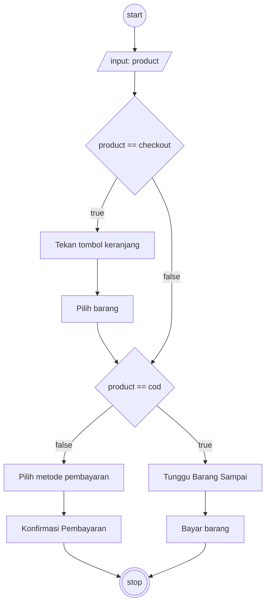

# Algoritma Checkout Tokopedia
## Algoritma Checkout Tokopedia berbentuk deskripsi
1. Mulai
2. Cari barang yang akan dibeli
3. Lakukan checkout dengan cara tekan tombol checkout, atau tekan tombol beli langsung
4. Jika menekan tombol checkout masuk ke keranjang 
5. Pilih Barang yang mau di checkout
6. Tentukan metode pengiriman
7. Jika pembayaran COD tunggu barang sampai 
8. Jika barang sudah sampai maka bayar barang tersebut kepada kurir
9. Jika pembayaran tidak ingin COD maka pilih metode pembayaran lain selain cod dan
10. Konfirmasi Pembayaran
11. Stop
    

## Algoritma Checkout Tokopedia berbentuk Flowchart
