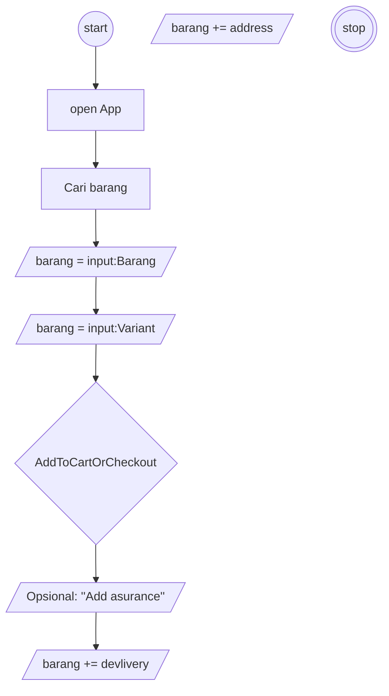

# Algoritma Checkout Tokopedia: study case membeli baju 

## Algoritma Checkout Tokopedia berbentuk deskripsi
1. Mulai
2. Buka aplikasi
3. Cari barang yang akan dibeli
4. Pilih Barang yang akan di checkout
6. Tentukan variant produk, seperti warna, Ukuran dan jumlah barang yang akan di checkout 
7. Tekan tombol 'Masukan ke keranjang' atau tekan tombol beli langsung
8. Tekan tombol keranjang yang ada di pojok kanan atas
9. Pilih Produk yang akan di pesan 
10. Jika sudah memilih barang yang akan di pesan tekan tombol beli yang ada di pojok kanan bawah
11. Tentukan alamat penerima
12. Pilih metode pengiriman 
13. (Opsional) menambahkan asuransi pengiriman dan asuransi barang rusak
14. Pilih voucher jika ada
15. Pakai bonus jika punya
16. tentukan methode pembayaran 
    1. Jika pembayaran COD maka tekan tombol beli sekarang dan tunggu sampai barang datang
    2. jika pembayarannya bukan cod maka 
    

## Algoritma Checkout Tokopedia berbentuk Flowchart
