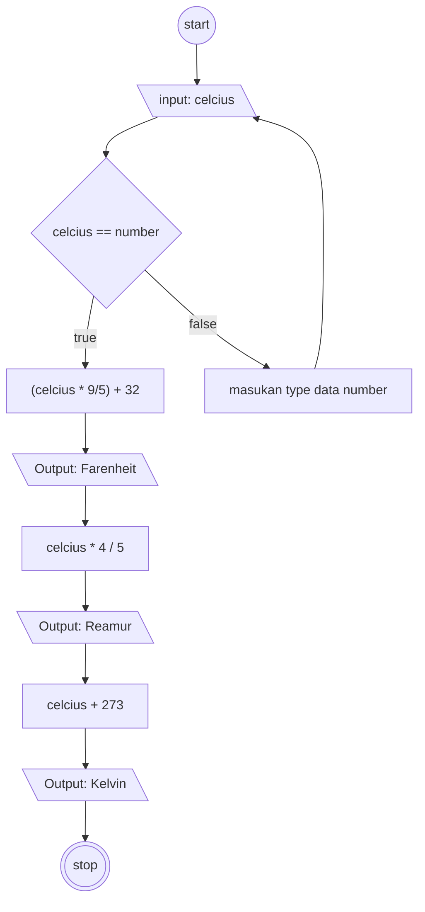

# Algoritma Program konversi suhu
1. Memiliki 1 input dalam bentuk Celcius
2. melakukan kovversi dari nilai input ke Farenheit, Reamur, Kelvin

## Algoritma dalam bentuk deskriptif
1. Mulai
2. Masukan nilai dalam bentuk integer ke dalam variable celcius 
3. Lakukan pengkonversian dari celcius ke farenheit dengan cara (celcius dikali 9 dibagi 5) ditambah 32
4. Lakukan pengkonversian dari celcius ke Reamur dengan cara celcius kali 4 dibagi 5
5. Lakukan pengkonversian dari celcius ke Kelvin dengan cara celcius ditambah 273 
6. Stop

## Algoritma dalam bentuk flowchart
