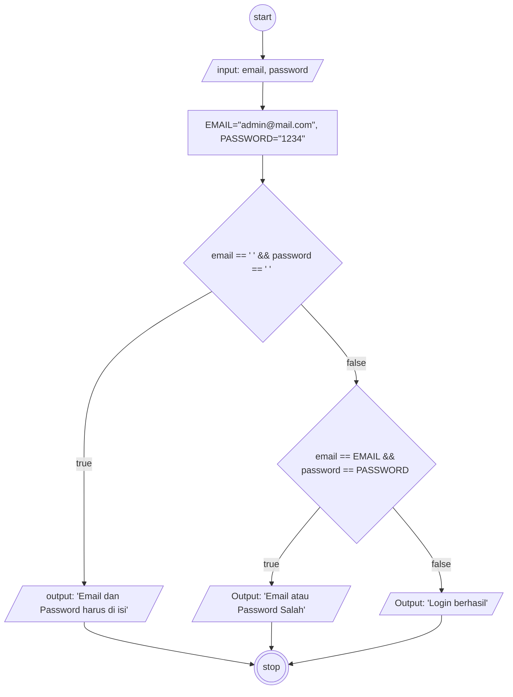

flowchart-email-password.md

1. Masukan Email dan pw
2. jika email & pw kosong
3. Munculkan "Email & pw hrs d isi"
4. jika tidak
5. jika email adalah admin@mail.com & pw adalah 1234
6. Munculkan Login berhasil
7. Jika tidak munculkan email atau password salah

