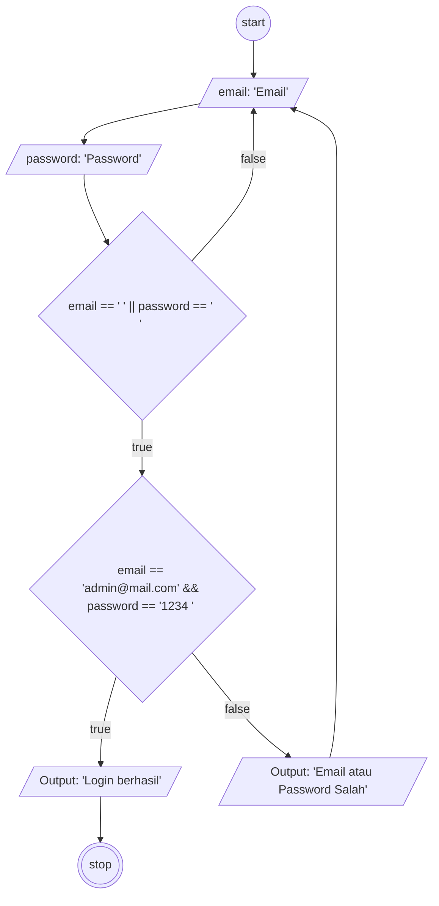

```mermaid
flowchart TB
 A@{ shape: circ, label: "start"} 
 B@{ shape: lean-r, label: "email: 'Email'"}
 C@{ shape: lean-r, label: "password: 'Password'"}
 D@{ shape: diamond, label: "email == ' ' || password == ' ' "}
 E@{ shape: diamond , label: "email == 'admin@mail.com' && password == '1234 ' "}
 F@{ shape: lean-r, label: "Output: 'Login berhasil'"}
 G@{ shape: lean-r, label: "Output: 'Email atau Password Salah'"}
 Z@{ shape: dbl-circ, label: "stop"}


A-->B-->C-->D
D-->|false|B
D-->|true|E
E-->|false|G-->B
E-->|true|F-->Z
```