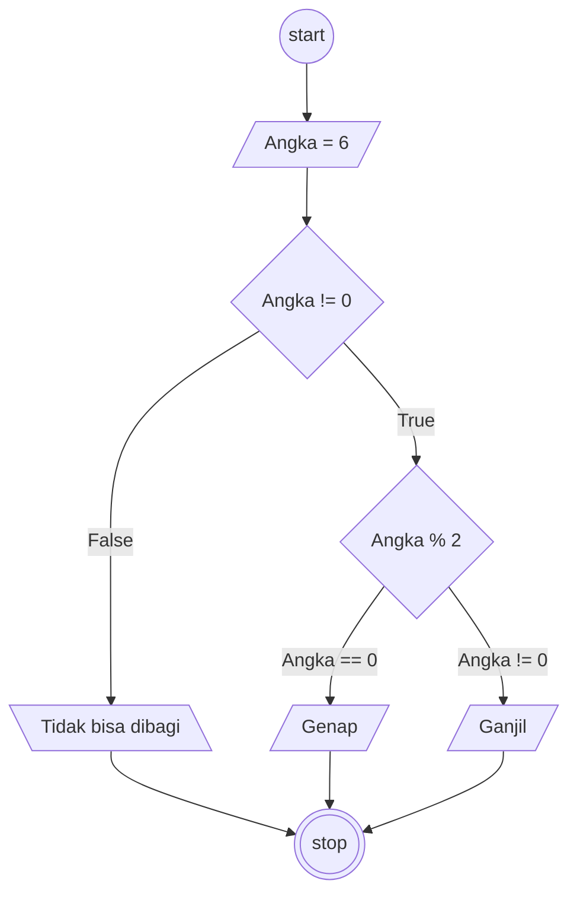

```mermaid
flowchart TB
 A@{ shape: circ, label: "start"} 
 B@{ shape: lean-r, label: "Angka = 6"}
 C@{ shape: diamond, label: "Angka != 0"}
 D@{ shape: lean-l, label: "Tidak bisa dibagi"}
 E@{ shape: diamond, label: "Angka % 2"}
 F@{ shape: lean-r, label: "Genap"}
 G@{ shape: lean-r, label: "Ganjil"}
 Z@{ shape: dbl-circ, label: "stop"}

 A-->B-->
 C-->|False|D-->Z
 C-->|True|E-->|Angka == 0|F 
 E-->|Angka != 0|G
 F-->Z
 G-->Z
 
```