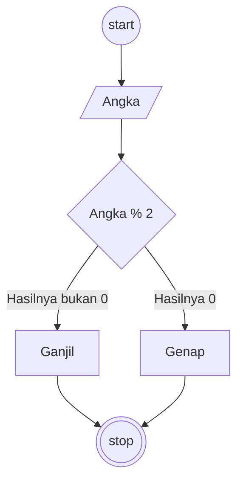

```mermaid
flowchart TB
 A@{ shape: circ, label: "start"} 
 B@{ shape: lean-r, label: "Angka"}
 C@{ shape: diamond, label: "Angka % 2"}
 D@{ shape: rect, label: "Genap"}
 E@{ shape: rect, label: "Ganjil"}
 Z@{ shape: dbl-circ, label: "stop"}
 A-->B-->
 C-->|Hasilnya 0|D[Genap]
 C-->|Hasilnya bukan 0|E[Ganjil]
 E-->Z
 D-->Z
```