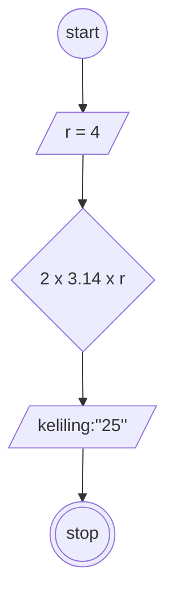

```mermaid
flowchart TB
 A@{ shape: circ, label: "start"} 
 B@{ shape: lean-r, label: "r = 4"}
 D@{ shape: diamond, label: "2 x 3.14 x r"}
 E@{ shape: lean-r, label: "keliling:''25''"}
 Z@{ shape: dbl-circ, label: "stop"}


A-->B-->D-->E-->Z

```