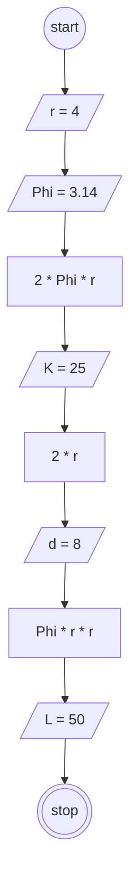

```mermaid
flowchart TB
 A@{ shape: circ, label: "start"} 
 B@{ shape: lean-r, label: "r = 4"}
 C@{ shape: lean-r, label: "Phi = 3.14"}
 D@{ shape: rect, label: "2 * Phi * r" }
 E@{ shape: lean-r, label: "K = 25"}
 F@{ shape: rect, label: "2 * r"}
 G@{ shape: lean-r, label: "d = 8"}
 H@{ shape: rect, label: "Phi * r * r"}
 I@{ shape: lean-r, label: "L = 50"}
 Z@{ shape: dbl-circ, label: "stop"}


A-->B-->C-->D-->E-->F-->G-->H-->I-->Z

```